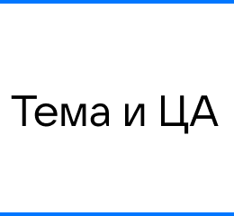
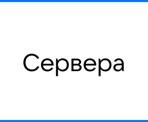
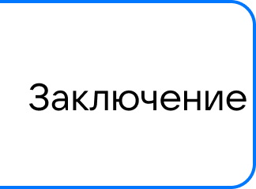
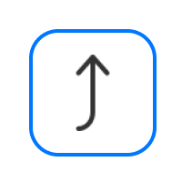
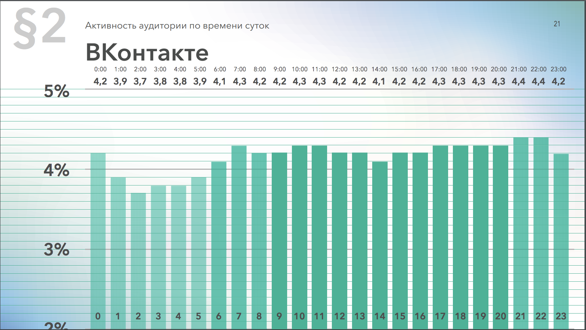
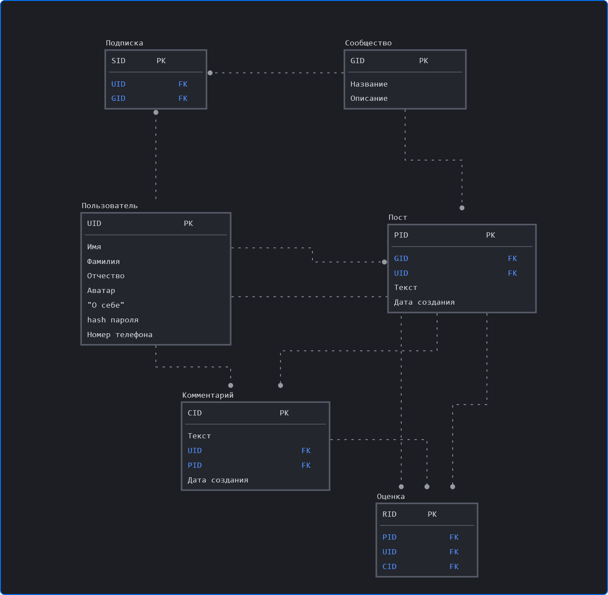
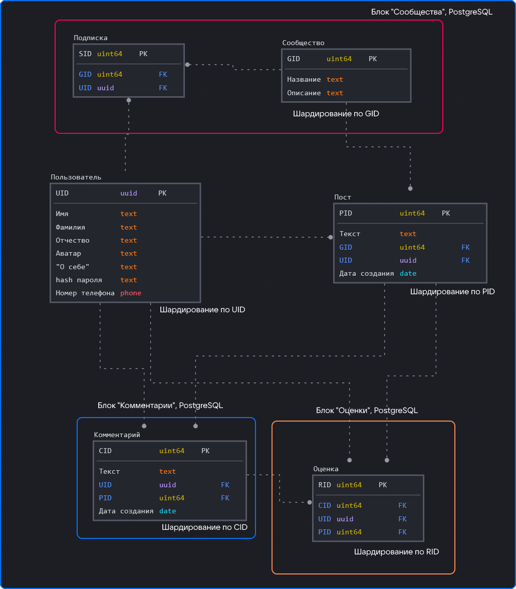
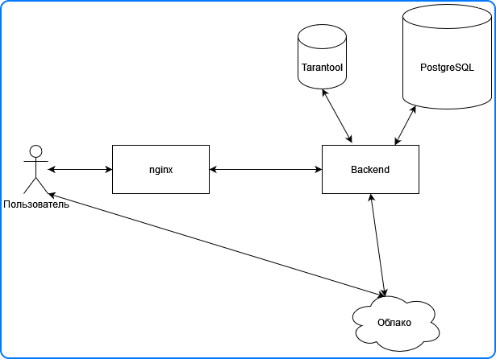
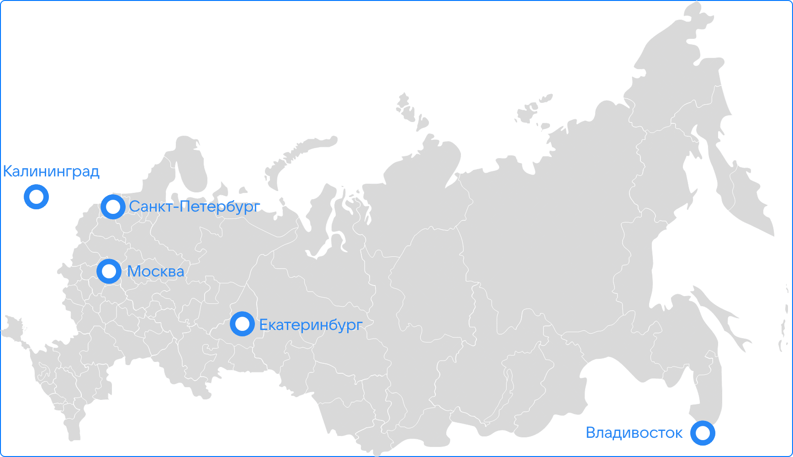

# technopark-highload-coursework

**ВКонтакте (*VK*)** — крупнейшая социальная сеть в России и странах СНГ. По данным *Alexa Internet*, vk.com занимает 36 место по посещаемости в мире и 3 место в России[1](#source-1). Социальная сеть доступна на 86 языках; пользователи сети обмениваются более 15 миллиардов сообщений в сутки и оставляют более 1 миллиардов отметок «*Нравится*» в сутки[2](#source-2).

## 1. Тема и целевая аудитория

Тип сервиса: *newsfeed social networking service*. 

Аналоги такого типа сервиса:

* *VK*;
* *Facebook*;
* *LiveJournal*;
* *Myspace*;
* *Odnoklassniki*;

Потенциальный размер аудитории: максимальный (общемировой) — 2,91 миллиарда пользователей в месяц (*Facebook*)[3](#source-3)

Оценка, учитывающая текущих пользователей в странах СНГ и ближнего зарубежья — 203,6 миллионов пользователей (активные интернет-пользователи России, Украины, Узбекистана, Казахстана, Азербайджана, Беларуси, Грузии, Молдавии, Армении, Таджикистана, Туркмении и Монголии)[А](#appendix-1)

Оценка с учетом потенциального роста числа пользователей сети Интернет до отметки в 95,5%: 269,5 миллионов пользователей[А](#appendix-1).

Для более справедливой оценки с учетом экономической ситуации возьмем число 

> 0,8 **⋅** 269,5 = 215,6 (миллионов пользователей).

Это число будем использовать в дальнейших расчетах.

### MVP

Ключевой функционал сервиса:

* Регистрация/авторизация пользователей, личные профили, содержащие информацию о пользователе;
* Система сообществ, объединяющих пользователей;
* Новостная лента, содержащая обновления друзей и сообществ и состоящая из постов с возможностью комментирования и оценивания;

### Целевая аудитория

По данным официальной аудированная отчетности компании *VK*, cредняя месячная аудитория (*MAU*) в России составляет **72,5** миллиона пользователей, дневная аудитория (*DAU*) — **47** миллионов (четвертый квартал 2021 года)[4](#source-4).

В то же время, данные рейтингов превышают эти цифры. Так, согласно данным MediaScope, в январе 2022 года месячная аудитория в России составила **79,1** миллионов человек [5](#source-5).

По данным платформы Semrush, мировая месячная аудитория сайта составила более **148,3** миллионов пользователей, что почти вдвое превышает данные официальной отчетности компании. Для дальнейших расчетов возьмем данные MediaScope.

Расположение аудитории согласно Semrush[6](#source-6):

| Позиция |       Страна      | MAU, млн | оценка DAU, млн[Б](#appendix-2) |
|:------: |:----------------- | --------:| --------:|
|  **1**  | 🇷🇺 Россия         | 109,1    | 70,73    |
|  **2**  | 🇺🇦 Украина        | 7,9      | 5,12     |
|  **3**  | 🇧🇾 Беларусь       | 7,0      | 4,54     |
|  **4**  | 🇰🇿 Казахстан      | 7,0      | 4,54     |
|  **5**  | 🇹🇷 Турция         | 4,9      | 3,18     |
|  **6**  | 🇺🇸 США            | 1,1      | 0,71     |
|  **7**  | 🇩🇪 Германия       | 0,7      | 0,45     |
|  **8**  | 🇫🇷 Франция        | 0,4      | 0,26     |
|  **9**  | 🇬🇧 Великобритания | 0,3      | 0,19     |
|    -    | 🇺🇳 Другие страны  | 9,9      | 6,42     |
|    -    | Всего:            | 148,3    | 96,14    |

Оценим расположение DAU по данным MediaScope[В](#appendix-3):

| Позиция |       Страна      | оценка MAU, млн | оценка DAU, млн |
|:------: |:----------------- | --------:| --------:|
|  **1**  | 🇷🇺 Россия         | 79,1    | 51,28    |
|  **2**  | 🇺🇦 Украина        | 5,7      | 3,71     |
|  **3**  | 🇧🇾 Беларусь       | 5,1      | 3,29     |
|  **4**  | 🇰🇿 Казахстан      | 5,1      | 3,29     |
|  **5**  | 🇹🇷 Турция         | 3,6      | 2,31     |
|  **6**  | 🇺🇸 США            | 0,8      | 0,51     |
|  **7**  | 🇩🇪 Германия       | 0,5      | 0,33     |
|  **8**  | 🇫🇷 Франция        | 0,3      | 0,19     |
|  **9**  | 🇬🇧 Великобритания | 0,2      | 0,14     |
|    -    | 🇺🇳 Другие страны  | 7,2      | 4,65     |
|    -    | Всего:            | 107,5    | 69,70    |

Покажем, что оценка верна: по отчету VK за 1 квартал 2022 года MAU выросла до 100,4 млн[8](#source-8).

## 2. Расчет нагрузки

### Продуктовые метрики

Согласно официальной статистике, пользователи сети обмениваются более 15 миллиардами сообщений в сутки и оставляют более 1 миллиарда отметок «*Нравится*» в сутки[2](#source-2).
Кроме того,в социальной сети в октября 2021 года насчитывалось **23,8** миллионов активных авторов и **408,8** миллионов "*сообщений*" (в терминологии авторов анализа — постов + комментариев) в месяц.
Возьмем соотношение комментариев к постам как 2/3.
По активности пользователи социальной сети оставляют по **17,2** публикаций на одного автора[7](#source-7).

В среднем каждый день в социальной сети добавляется примерно:

> (408'800'000 / 3 * 2) / 30 = 9'080'000 комментариев

Посчитаем RPS:

> 9'080'000 / (24 **⋅** 60 **⋅** 60) = 105,09 RPS

В среднем каждый день в социальной сети добавляется примерно:

> (408'800'000 / 3) / 30 = 4'540'000 постов

Посчитаем RPS:

> 4'540'000 / (24 **⋅** 60 **⋅** 60) = 52,55 RPS

В среднем один пользователь проводит во ВКонтакте **37 минут в день**, по данным Mediascope (*webindex, ноябрь 2019, Россия, 0+*). Пользователи десктопной версии тратят на соцсеть меньше времени — в среднем **20 минут в день**. Продолжительность сессий на мобильных устройствах выше и составляет **39 минут в день**.

Возьмем DAU как 69,70 млн пользователей.

В среднем число активных пользователей в час не превышает **4,4** %[9](#source-9):

При этом каждый день наиболее нагруженными часами являются вечерние и дневные часы (в сумме 9 часов)

Расчитаем число запросов на составление ленты (допустим, что пользователи делают 12 запросов в сутки на ленту в течение 9 самых активных часов):

> 69'700'000 **⋅** 12 / (9 **⋅** 60 **⋅** 60) = 25'814,81 RPS.

Расчитаем число запросов на получение комментариев:

> 69'700'000 **⋅** 10 / (9 **⋅** 60 **⋅** 60) = 21'512,35 RPS.

Расчитаем число запросов на лайки в секунду:

> 1'000'000'000 / (24 **⋅** 60 **⋅** 60) = 11'574,07 RPS

### Среднее количество RPS по типам действий

| Действие | RPS | Взаимодействие
|:---:|:----------- | :----------:|
| Добавление постов | 52,55      | запись |
| Добавление комментариев | 105,09      | запись |
| Чтение постов (лента) | 25'814,81     |  чтение |
| Чтение комментариев | 21'512,35     |  чтение |
| Оценки | 11'574,07  |  запись |

В сумме:

**11'731,71 RPS на запись**

**47'327,16 RPS на чтение**

## 3. Логическая схема

Выделим следующие сущности:

* Пользователь;
* Сообщество;
* Подписка (пользователя на сообщество);
* Подписка (пользователя на пользователя);
* Пост (в сообществе, посты вне сообществ можно вынести в отдельное "сообщество");
* Комментарий;
* Оценка (лайк).

## 4. Физическая схема

Для хранения большинства данных проекта будет использована реляционная СУБД PostgreSQL. 

Для удобства высоконагруженных записи и чтения весь проект разбит на 3 блока:

* Блок "Прочее" используется для работы приложения;
* Блок "Комментарии" используется для удобства получения и записи информации о комментариях (таблица Комментарий);
* Блок "Сессии" - раздельная таблица в Tarantool (таблица Сессия);

Для хранений сессий пользователей оптимально использование нереляционной СУБД Tarantool.

Дополнительные (кроме автоматических на **primary key**) индексы:

* Индекс на телефон в пользователе (для поиска всех пользователей по номеру телефона);
* Индекс на GID в сообществе (для поиска всех постов группы);
* Индекс на UID в оценке (для поиска всех оценок пользователя).

Данные (при условии, что *uint64* и *uuid* — 16 байт, *date* — 15 байт, *text* — в среднем 100 байт):

* Один пользователь займет примерно 716 байт;
* Один средний по длине комментарий займет примерно 163 байт;
* Одна оценка займет примерно 64 байт;
* Одна подписка займет примерно 48 байт x2 = 96 байт;
* Один пост займет примерно 163 байт;
* Одно сообщество займет примерно 200 байт;
* Одна сессия займет примерно 131 байт.

Шардировать будем комментарии по UID.

## 5. Технологии

| Технология | Область применения | Мотивационная часть
|:---:|:----------- | :----------:|
| TS, React+Redux | Frontend      | Выбор языка: строгая типизация + скорость разработки. Выбор технологии: скорость работы, компонентная декомпозиция, документация и коммьюнити разработчиков |
| Golang, Gin  | Backend     |  Выбор языка: скорость работы + скорость разработки. Выбор технологии: скорость работы, простая документация |
| nginx  | Balancer     |  Масштабируемость, поддержка шифрования, простота конфигурации |
| PostgreSQL, Tarantool | Databases  |  PostgreSQL: надежные механизмы транзакций и репликаций, легкая расширяемость. Tarantool: скорость работы, работа на высоких нагрузках, поддержка транзакций и репликаций |
| Облако Mail.ru | Media   |  Упрощенная работа (инструмент от той же компании), простота конфигурации |
| Swift, RxSwift | iOS | Выбор языка: скорость разработки + коммьюнити разработчиков. Выбор технологии: поддержка реактивности, возможность адаптирования конструкционных идей с Frontend-разработки |
| Kotlin, RxKotlin | Android | Выбор языка: коммьюнити разработчиков + удобство программирования. Выбор технологии: поддержка реактивности, возможность адаптирования конструкционных идей с Frontend-разработки |

## 6. Схема проекта

Проект состоит из следующих частей:

* Сервера, раздающие фронтенд. Бандлы кода может просто раздавать nginx, поэтому эти сервера по сути объединены с nginx;
* nginx-балансировщики нагрузки между серверами;
* Backend-сервера для API;
* PostgreSQL-сервера для каждого блока данных;
* Tarantool-сервера для сессионных хранилищ;
* Облачные сервера для хранения медиаинформации.

| Сервер | Предельное количество RPS / ядро | Мотивационная часть
|:---:|:----------- | :----------:|
| nginx | 250 | Без SSL больше, шифрование сильно сокращает скорость работы |
| backend | 2000 | Golang + Gin на 8Гб ОЗУ |
| PostgreSQL | -- | Не особо принципиально, главное, чтобы хватало самой памяти |
| Tarantool | -- | Не особо принципиально, главное, чтобы хватало самой памяти | 
| Облачные сервера | 1000 | Примерно на картинки и аудио |

Объем требуемой памяти:

* Пользователи: 716 байт **⋅** 269'500'000 = 193 Гб.
* Подписки (допустим, что их более 300 млн): 96 байт **⋅** 300'000'000 = 28,8 Гб
* Посты: 163 байт **⋅** 4'540'000 = 740 Мб / сутки => 270,1 Гб / год;
* Комментарии: 163 байт **⋅** 9'080'000 = 1,48 Гб / сутки => 580 Гб / год;
* Оценки: 64 байт **⋅** 1'000'000'000 = 64 Гб / сутки => 25,08 Тб / год;
* Сообщества (допустим, что их более 100 млн): 200 байт **⋅** 100'000'000 = 20 Гб;
* Сессии: 131 байт **⋅** 69'700'000 = 8,504 Гб.

Таким образом, в общей сложности, необходимо с запасом: 100 Тб на всю память x 4 (1 мастер и 3 реплики) => 400 Тб.

Конфигурация балансировки: L7 nginx с запасными бэкендами и БД, имеющими запас веса.

## 7. Список серверов

Расчитаем число серверов:

Frontend + balancer:

> (69'700'000 **⋅** 16 / (9 **⋅** 60 **⋅** 60)) / (250 **⋅** 16) **⋅** 3 = 25,8 => 27 x 2 (резерв) = 54

Backend:

> (59'058) / (2000 **⋅** 32) = 0,9 => 1 x 5 x 2 (геокластеры и резерв) = 10

Конфигурация серверов:
| Задача | CPU | RAM, Гб | Количество серверов |
|:---:|:----------- | :----------:| :----------:|
| Frontend + balancer nginx | 16 | 256 | 54 |
| Backend | 32 | 256 | 625 |
| PostgreSQL | 32  | 512 | 33 |
| Tarantool | 16 | 128 | 22 |

Местоположение серверов:
| Город | Часть | Зона | nginx | Backend | PostgreSQL | Tarantool |
|:---:|:----------- | :----------:|:----------:|:----------:|:----------:|:----------:|
| Москва | 0,30 | Юг европейской части России, Кавказ | 16 | 2 | | |
| Санкт-Петербург | 0,25 | Север европейской части России, север Сибири | 14 | 2| 
| Екатеринбург | 0,25  | Юг Сибири | 14 | 2 |
| Владивосток | 0,10 | Тихоокеанское побережье, Азия (зарубежье) | 5 | 2 |
| Калининград | 0,10 | Европа (зарубежье) | 5 | 2 |

Запросы на геокластеры будут приходить через DNS. Каждому кластеру понадобится два балансировщика для распределения запросов между серверами (оснойной и дублирующий резервный).

## Заключение

## Список используемых источников

1.  [Данные веб-сайта alexa.com](https://www.alexa.com/siteinfo/vk.com) (дата обращения: 07.03.2022);

2.  [Раздел "О нас" на сайте социальной сети](https://vk.com/about) (дата обращения: 07.03.2022);
   
3.  [Слайды статистики Facebook за 3 квартал 2021 года](https://investor.fb.com/investor-events/event-details/2021/Facebook-Q2-2021-Earnings/) (дата обращения: 07.03.2022);

4.  [VK Company Limited: аудированная отчетность по МСФО за 2021 год](https://vk.company/ru/press/releases/11106/) (дата обращения: 07.03.2022);

5.  [Mediascope, WEB-Index, январь 2022, Россия 0+, население в возрасте 12+ лет](https://mediascope.net/data/) (дата обращения: 07.03.2022);

6.  [Статистика согласно сервису Semrush.com](https://www.semrush.com/analytics/overview/?q=vk.com) (дата обращения: 07.03.2022);

7.  [Социальные сети в России: цифры и тренды, осень 2021](https://gipp.ru/overview/issledovaniya-statistika/sotsialnye-seti-v-rossii-tsifry-i-trendy-osen-2021/)

8.  [ВКонтакте подвела итоги первого квартала 2022 года](https://vk.com/press/q1-2022-results)

9.  [20 цифр и фактов о ВКонтакте, необходимые маркетологу в 2020](https://popsters.ru/blog/post/svezhie-dannye-o-vk)

##  Приложение А. Оценка роста ЦА социальной сети

Был проведен анализ рынка стран СНГ и ближнего зарубежья, потенциально являющихся рынками для социальной сети.

| Рейтинг в мире | Страна | Активных пользователей сети Интернет, человек | Год проведения исследования | % населения |
|:---:|:----------- | :----------:| :--: | :--: |
|   5 | 🇷🇺 Россия      | 114 920 477 | 2018 | 80,9 |
|  29 | 🇺🇦 Украина     |  31 100 000 | 2022 | 71,8 |
|  42 | 🇺🇿 Узбекистан  |  15 705 402 | 2018 | 52,3 |
|  44 | 🇰🇿 Казахстан   |  14 789 448 | 2018 | 78,9 |
|  60 | 🇦🇿 Азербайджан |   8 017 120 | 2018 | 79,8 |
|  67 | 🇧🇾 Беларусь    |   7 539 145 | 2018 | 79,1 |
|  96 | 🇬🇪 Грузия      |   3 151 218 | 2018 | 64,0 |
| 105 | 🇲🇩 Молдавия    |   2 616 792 | 2018 | 76,1 |
| 118 | 🇦🇲 Армения     |   1 966 942 | 2018 | 64,7 |
| 119 | 🇹🇯 Таджикистан |   1 889 632 | 2018 | 22,0 |
| 130 | 🇹🇲 Туркмения   |   1 149 840 | 2018 | 21,3 |
| 142 | 🇲🇳 Монголия    |     735 823 | 2018 | 23,7 |
|  -  | Всего       | 203 581 839 |   -  |   -  |

Было расчитано максимальное число пользователей сети с учетом роста числа активных пользователей сети Интернет.

[Ссылка на анализ](./data/target-audience.ipynb)

##  Приложение Б. Оценка DAU

[Ссылка на анализ](./data/dau-average.ipynb)

##  Приложение В. Оценка распределения DAU по MediaScope

[Ссылка на анализ](./data/geographical-dau.ipynb)
